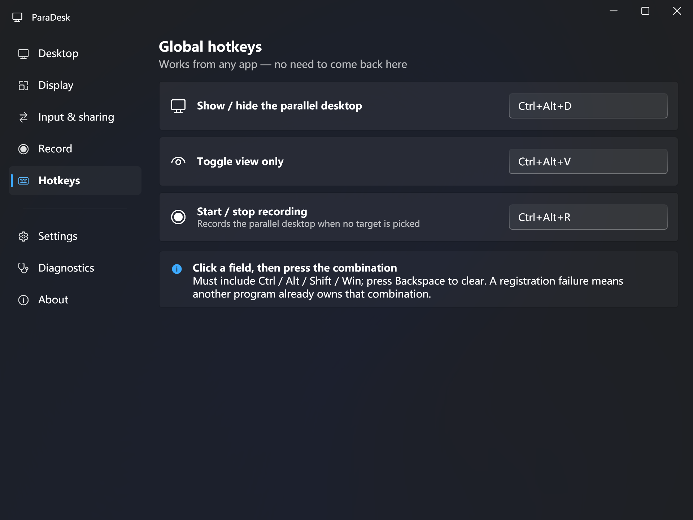
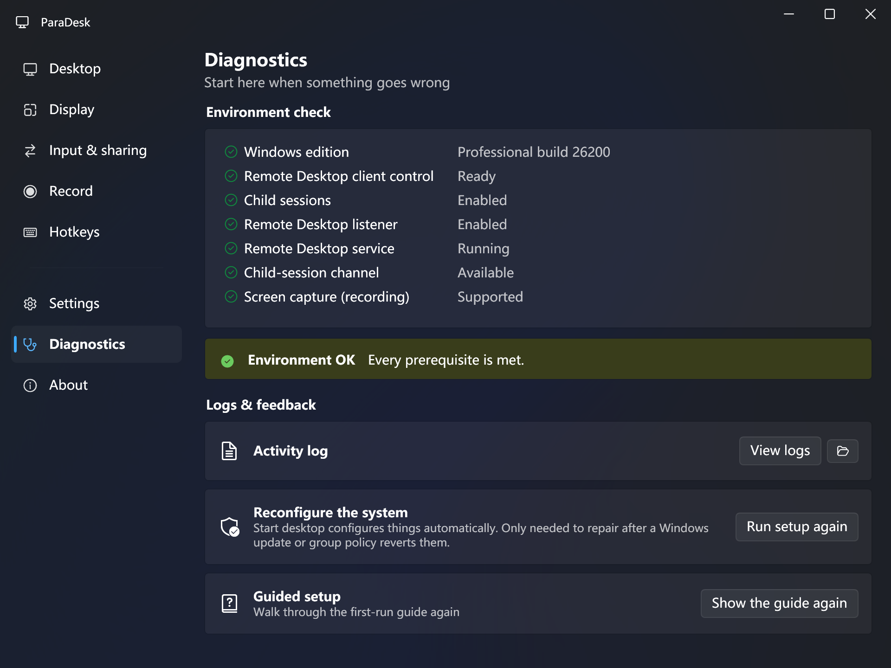

# ParaDesk

**A second Windows desktop on your spare monitor — with its own mouse and keyboard, sharing your account and all your files.**

[简体中文](#简体中文) · Windows 10 1903+ / Windows 11 · Pro edition or higher
· Open source under the [MIT License](LICENSE) — personal and commercial use welcome


---

## What problem this solves

AI coding agents (Claude Code, Codex, Copilot) increasingly drive the computer by looking at the screen and moving the mouse. While one is working, **your machine is unusable** — every click you make fights the agent for control.

The obvious fix is a virtual machine. But a VM is a *different computer*: different account, no shared files, and the agent's memory and work-in-progress do not carry over. You end up copying files back and forth all day.

ParaDesk takes the opposite trade. It opens a **second interactive Windows session for the same user account** on a monitor you pick:

- **Input is genuinely isolated** — Windows sessions each own their input queue. What the agent types over there never reaches your keyboard focus, and vice versa. This is enforced by the OS, not by a hook.
- **Everything else is shared** — same account, same disk, same installed apps, same browser logins. The agent's context and progress simply continue.

The trade-off is explicit and stated in the app: **there is no security isolation.** The second desktop can read every file you can. It is a productivity boundary, not a security boundary. If you need a security boundary, use a VM or Windows Sandbox.

---

## How it works

ParaDesk does not implement its own display or session stack. It drives a Windows feature that already exists:

```
WTSEnableChildSessions(true)        ← one-time, needs administrator
        │
        │  creates a second interactive session for the same account
        ▼
Remote Desktop client ActiveX (mstscax)
    Server   = "localhost"
    ConnectToChildSession = true    ← attaches to the local child session
        │
        │  loopback only — traffic never leaves the machine
        ▼
borderless window pinned to the monitor you chose
```

Consequences worth knowing:

| | |
|---|---|
| **Why input is isolated** | A Windows *session* owns its window station, desktop and input queue. Injected input in session B cannot reach session A. |
| **Why files are shared** | It is the same user account signing in a second time. No virtualisation layer exists. |
| **Why it needs Pro** | The child-session transport rides the Terminal Services stack. Home edition has no RDP *server* component at all — this is a missing component, not a disabled switch. |
| **Why recording needs WGC** | The RDP control composites through DirectX/DWM. GDI `BitBlt`/`PrintWindow` capture comes back black; only Windows.Graphics.Capture sees it. |
| **Why loopback quality is maxed** | No bandwidth is consumed locally, so hardware decoding and framebuffer sharing are enabled unconditionally. |

---

## Features

### Parallel desktop
- Full screen pinned to a monitor, resizable window, or floating picture-in-picture
- **Change resolution and scale live** — applies while connected, no reconnect
- Visual monitor map; click to assign. Screen identification overlay with big numbers
- **Rename your monitors** — "Left portrait", "AI workspace" — used everywhere in the app
- Profiles: different setups per monitor arrangement, auto-applied on hot-plug
- **View only** — locks *your* physical keyboard and mouse out of the parallel desktop so you cannot disturb the agent by accident. Input injected by automation is unaffected.
- **Starts and re-attaches by itself** — optionally open the parallel desktop as soon as ParaDesk starts (or re-attach if it is still running in the background); together with *Run at startup* it is ready for the agent after you sign in. If the view drops while the session is still alive, ParaDesk re-attaches automatically (on by default).
- Per profile: a command to **run after sign-in** inside the parallel desktop, and **keep awake** so long unattended runs are not interrupted by sleep or the idle lock screen
- **Sound** — play the parallel desktop's audio on this PC, or mute it (Input & sharing → Parallel desktop sound; applies the next time it starts or re-attaches)
- Clipboard policy: shared / manual / off
- Browser isolation helper: one browser profile cannot run on both sides, so ParaDesk generates a shortcut with its own profile


### Screen recording
- Record **a single parallel-desktop window** or a whole monitor
- Audio: system loopback, microphone, or both mixed
- Pause and resume (paused time is excluded from the video), plus stills
- H.264 + AAC MP4, adjustable frame rate and bitrate
- **Low frame rates for long sessions** — 1, 2 or 5 fps keeps hours of agent work reviewable at a fraction of the file size
- **Record along with the parallel desktop** — starts when it connects, stops when you hide or close it
- **Split into segments** — long recordings are cut into files of a set length; if something crashes, only the last segment is lost
- **Disk-space guard** — refuses to start on a nearly full drive, warns when space runs low, and stops cleanly before the drive fills up so the file stays playable


### Command line & notifications
- Script it: start, hide, close, record, take screenshots and query the state from any terminal — **including one inside the parallel desktop** (see [Command line](#command-line))
- `--notify` shows a notice on your main desktop, optionally with a sound, and badges the tray icon until you look — agents use it to say "done" or "I need you"
- `--status --json` and `state.json` tell scripts and agents which monitor and resolution the parallel desktop has

### Everything else
- Global hotkeys — show/hide the desktop, toggle view-only, start/stop recording; more actions (screenshot, pause/resume recording, hide the desktop, clipboard push/pull) can be bound but are unbound by default
- Tray resident, run at startup, single-instance activation
- Frame-rate cap driven by the **actual refresh rates your monitors report**
- First-run guide, in-app log viewer, environment diagnostics with one-click repair, diagnostic bundle export, and one-click undo of the system configuration
- Update check — **optional and off by default**; when on, ParaDesk asks GitHub for the latest release at startup. Apart from that it does not go online.
- Full English and Simplified Chinese, switchable at runtime




---

## Requirements

- Windows 10 1903+ or Windows 11
- **Pro, Enterprise or Education** — Home has no child-session support
- .NET Framework 4.8 (ships with Windows 10 1903+)
- One administrator approval on first use; everyday use needs no elevation

**Windows on Arm.** There is a native Arm64 build (`ParaDesk-<version>-arm64.zip`; the installer picks it automatically on Arm devices). It needs Windows 11 on Arm with .NET Framework 4.8.1, which ships with Windows 11 22H2 and later. The regular build also works on Arm devices, but Windows runs it under x64 emulation. *About* and `--probe` show which one is running.

## Getting started

```powershell
git clone https://github.com/sinpoce/ParaDesk.git
cd ParaDesk
.\build.ps1 -Run
```

Press **Start desktop**. If the system has not been configured yet, ParaDesk asks once, takes a single administrator approval, and configures everything itself.

**A restart is required after that first configuration.** The Remote Desktop service cannot be restarted while a console session is active, so the child-session listener only comes up at boot.

### What the one-time configuration changes

- Enables Windows child sessions
- Enables the Remote Desktop listener (child sessions ride on it; ParaDesk itself only ever connects over loopback)
- Enables the Remote Desktop firewall rules that apply to **private and domain networks only** — rules that would also open the port on public networks are left alone (on most Windows 11 PCs that means none at all)
- Allows delegating your default credentials to **this machine only** (`TERMSRV/localhost`, `TERMSRV/127.0.0.1`, `TERMSRV/<computer name>`), so you are not asked for a password on every connect. If an older ParaDesk version added the `TERMSRV/*` wildcard — which would hand your credentials to any Remote Desktop server — it is removed.
- Turns off "Always prompt for password" for Remote Desktop, which would otherwise override the delegation
- Sets the Remote Desktop service to start automatically
- Turns off Windows **Cross Device Resume** for your account (`IsResumeAllowed` / `IsOneDriveResumeAllowed` = 0 under `HKCU\Software\Microsoft\Windows\CurrentVersion\CrossDeviceResume\Configuration`) and adds a small helper to your per-user startup list (`HKCU\Software\Microsoft\Windows\CurrentVersion\Run\ParaDeskChildAgent`). The helper only does anything inside the parallel desktop: it dismisses the spurious CrossDeviceResume error dialog (see [Known limitations](#known-limitations)) and carries out *Run after sign-in* and *Keep awake* — which is why it is also registered whenever a profile uses one of those. These two per-user changes need no administrator rights; ParaDesk makes them itself once the approved step has finished.

The previous values are recorded before the first change. **Diagnostics → Undo system setup** puts them back (one administrator approval) — see [Troubleshooting](#troubleshooting) for where they are kept and when undo cannot restore everything.

---

## Using with AI agents

The idea: the agent works **inside** the parallel desktop, on its own monitor, with its own mouse and keyboard. Your desktop stays yours.

1. **Start the parallel desktop** on the spare monitor — *Start desktop* on the Desktop page, or `ParaDesk.exe --start --wait`.
2. **Launch the agent inside it.** Open a terminal in the parallel desktop and start Claude Code / Codex there. What it sees, clicks and types is that session's screen; its screenshots are of the parallel desktop, not of yours.
3. **Automate the setup** (Input & sharing page, saved per profile):
   - **Run after sign-in** — a command run once each time the parallel desktop signs in, for example `wt -d C:\src\my-repo` to open Windows Terminal in your repository. A desktop that is already signed in picks up a change after it has been closed and started again.
   - **Keep awake** — keeps the PC from sleeping and the parallel desktop from locking itself when idle.
4. **Turn on View only** in that profile, so a stray click of yours cannot land in the agent's session. Input injected by the agent is unaffected; `Ctrl+Alt+V` toggles it.
5. **Keep a recording as an audit trail** (Record page): *Record along with the parallel desktop*, a 1–5 fps frame rate, and *Split into segments* for runs that last hours.
6. **Let the agent call you.** Command-line commands work from inside the parallel desktop — they are forwarded to ParaDesk on your main desktop. For Claude Code, merge this into `~/.claude/settings.json` (or a project's `.claude/settings.json`):

   ```json
   {
     "hooks": {
       "Stop": [ { "hooks": [ { "type": "command", "command": "\"C:\\path\\to\\ParaDesk.exe\" --notify --title \"Claude Code\" --body \"Task finished\" --sound" } ] } ],
       "Notification": [ { "hooks": [ { "type": "command", "command": "\"C:\\path\\to\\ParaDesk.exe\" --notify --title \"Claude Code\" --body \"Needs your confirmation\" --level warn --sound" } ] } ]
     }
   }
   ```

   Replace `C:\\path\\to` with the folder ParaDesk lives in (backslashes are doubled inside JSON), or let **Settings → AI tool integration → Copy Claude Code notification config** generate it with the real path. When the task finishes or needs your confirmation, your main desktop gets a notice and the tray icon keeps a badge until you look. Any other agent or script can call `--notify` the same way.
7. **Tell the agent where it is.** `ParaDesk.exe --status --json` — or reading `%LOCALAPPDATA%\ParaDesk\state.json` directly — reports the parallel desktop's state:
   - `desktopState` (`idle` / `connecting` / `connected` / `reconnecting` / `closing`), `attached` (view open), `childSessionExists`
   - `width`, `height` — the parallel desktop's resolution; `scalePercent` — its scale (0 = follows the monitor)
   - `monitorName`, `monitorDevice`, `monitorX`, `monitorY`, `monitorWidth`, `monitorHeight` — the monitor it is shown on, in physical pixels of your main desktop's coordinate space
   - `viewOnly`, `recording`, `recordingPath`, plus `running`, `pid` and `updatedAt` to tell whether the file is current

   An agent running inside the parallel desktop sees a single screen of `width` × `height` starting at 0,0; the `monitor*` fields describe where that picture sits on your main desktop, for tools that look at it from outside. When ParaDesk is not running, `--status --json` still prints the last snapshot with `"running": false` and exits with 3.

---

## Command line

`ParaDesk.exe` is also its own command-line client. These commands are forwarded to the running ParaDesk on your main desktop, and also work **from inside the parallel desktop**:

| Command | What it does |
|---|---|
| `--status [--json]` | Current state. `--json` prints the state snapshot. Exit code 3 when ParaDesk is not running (with `--json` it still prints a snapshot, `"running": false`) |
| `--start [--profile <name>] [--wait]` | Start the parallel desktop or re-attach to it. `--profile` switches profile first (unknown name: exit code 64). If the machine is not ready it returns 2 with the reason — it never triggers an administrator prompt. `--wait` waits until connected or failed (up to 100 s) |
| `--detach` | Hide the view; the child session keeps running |
| `--close` | Sign out of the child session (ends every program in it), without a confirmation dialog |
| `--view-only on\|off\|toggle` | View only |
| `--topmost on\|off\|toggle` | Keep the parallel desktop window on top |
| `--record start\|stop\|pause\|resume\|toggle [--target desktop\|monitor]` | Recording. From the command line `start` records only the parallel desktop window and exits with 1 if the view isn't open; add `--target monitor` to record a monitor. (The hotkey and tray fall back to the profile's monitor.) This keeps an agent inside the parallel desktop from silently recording your own screen |
| `--screenshot [<path>]` | Capture the parallel desktop view and print the file path; exits with 1 if the view isn't open. A relative path is relative to the current directory; without a path it goes to the recording folder and never overwrites. An explicit file path replaces an existing file; the image is always PNG (`.png` is appended otherwise) |
| `--notify [--title <text>] [--body <text>] [--level info\|warn\|error] [--sound]` | Show a notice on the main desktop. The body can also be given as a plain argument |
| `--show` | Bring up the main window |
| `--quit` | Exit ParaDesk and wait (up to 60 s) until it has really exited: recording is finalised first, the parallel desktop is only hidden (the child session stays), no confirmation dialogs |

All of them accept `--json` for machine-readable output (pure ASCII).

Run locally, no running ParaDesk needed:

| Command | What it does |
|---|---|
| `--probe [--json]` | Read-only environment check (see [Troubleshooting](#troubleshooting)) |
| `--diagbundle [<path>]` | Write a diagnostic zip (default: on your Desktop) and print its path |
| `--logictest`, `--i18ntest`, `--dlgtest`, `--rectest [sec]`, `--contenttest` | Self-tests, see [Self-tests](#self-tests) |
| `--help`, `--version` | Every command and option / the version |

Start-up options for the window: `--minimized` (start in the tray), `--autostart` (added by the sign-in startup entry; ParaDesk exits silently when launched this way inside the parallel desktop or when it is already running) and `--restart <pid>` (used internally when switching language). Option names are case-insensitive; an unknown `--option` prints the help and exits with 64.

| Exit code | Meaning |
|---|---|
| 0 | Success |
| 1 | Ran but failed (the reason is in the output) |
| 2 | Environment not ready or not supported |
| 3 | ParaDesk is not running |
| 64 | Wrong arguments |

**ParaDesk.exe is a window (WinExe) program**, and shells do not wait for window programs. To get the output *and* the exit code in PowerShell, capture or pipe the output — PowerShell then waits and sets `$LASTEXITCODE` — or use `Start-Process -Wait`:

```powershell
$state = & "C:\path\to\ParaDesk.exe" --status --json | ConvertFrom-Json
$LASTEXITCODE

$p = Start-Process "C:\path\to\ParaDesk.exe" -ArgumentList '--start', '--wait' -Wait -PassThru -NoNewWindow
$p.ExitCode
```

In cmd use `start "" /wait "C:\path\to\ParaDesk.exe" --status` and then `%ERRORLEVEL%`. `--json` output is pure ASCII, so it survives any console code page; redirected text output is UTF-8 — in Windows PowerShell 5.1, set `[Console]::OutputEncoding = [Text.Encoding]::UTF8` before piping non-English text.

---

## Building

```powershell
.\build.ps1              # Debug
.\build.ps1 -Release     # Release
.\build.ps1 -Run         # build, then start it
.\build.ps1 -Probe       # build, then print the environment probe
.\build.ps1 -Arm64       # native Arm64 build (output in bin\ARM64\)
.\publish.ps1            # portable zips (AnyCPU and arm64) + installer into dist\
```

Only the **.NET SDK** is required — `dotnet build` uses the SDK's MSBuild. Visual Studio and Build Tools are *not* needed: the net48 reference assemblies are a standalone component, and this project does not use `COMReference` interop generation.

- **A running ParaDesk** locks the exe in its output folder. The scripts do not stop it on their own — it may be hosting the agent's parallel desktop or recording — and ask you to add **`-Force`**, which stops only the ParaDesk processes started from that output folder (for `publish.ps1` also from the previous `dist\ParaDesk-<version>\`, which it rebuilds). For the main program, `-Force` closes the view; the child session itself survives. Exiting ParaDesk from the tray first does the same without `-Force`.
- **The parallel desktop's helper** (`ParaDesk.exe --childagent`) runs from whichever copy of ParaDesk you started last and keeps running until the parallel desktop signs out. Exiting ParaDesk from the tray does not stop it, so the scripts list it separately. Either sign out of the parallel desktop (sign out inside it, or *Close desktop*; this ends every program in it) or use `-Force`. After `-Force` stops the helper, *Keep awake* and the error-dialog guard stay off until the parallel desktop next signs in.
- **NuGet cache**: packages go to NuGet's default cache. Setting `NUGET_PACKAGES` to put them elsewhere is optional.
- **`publish.ps1`** takes the version from `<Version>` in the csproj (`-Version` overrides it). It must be three numbers such as `1.2.3` — that is what the app reports and compares when it checks for updates, so four-part versions and `-beta` suffixes are refused. It packages every `.exe` / `.dll` / `.config` of the Release output and warns about anything it leaves out, writes `README.txt` and `使用说明.txt`, and prints SHA-256 checksums. `-SelfTest` runs `selftest.ps1 -Quick` against the Release build first; `-NoInstaller` skips the installer.
- **Arm64**: `publish.ps1` builds both flavours by default (`-Platform AnyCPU` or `-Platform ARM64` builds just one) and produces `ParaDesk-<version>.zip` and `ParaDesk-<version>-arm64.zip`. The installer contains both and installs the Arm64 build on Arm devices that have .NET Framework 4.8.1. `selftest.ps1 -Release -Arm64` tests the Arm64 build; it only runs on an Arm device.
- **The installer** needs Inno Setup 6.3 or later (`-IsccPath` if it is not in a standard location). If that Inno Setup has `Languages\ChineseSimplified.isl` — an unofficial translation, not part of the standard install — the installer gets a Chinese UI as well; otherwise it is English-only and `publish.ps1` tells you where to put the file.
- **CI** (`.github/workflows/build.yml`) builds Release (AnyCPU and Arm64) on every push and pull request to `main`, runs `--i18ntest`, `--logictest`, `--probe --json` and `--help`, and uploads both build outputs. A second job runs the same checks natively on a Windows 11 Arm runner and fails if the Arm64 build is not running natively.

## Self-tests

```powershell
.\selftest.ps1              # all checks below except the developer-only ones
.\selftest.ps1 -Quick       # skip the recording checks
.\selftest.ps1 -Release     # test the Release build (default: Debug); -Exe <path> tests any ParaDesk.exe
```

| Command | Checks | Exit codes |
|---|---|---|
| `ParaDesk.exe --probe` | Environment probe; changes no configuration | 0 ready · 2 not ready |
| `ParaDesk.exe --logictest` | Pure logic, runs in seconds without a desktop: command parsing, the control protocol, settings migration, recording options, version comparison and more | 0 · 1 |
| `ParaDesk.exe --i18ntest` | Localisation dictionary: duplicate keys, placeholder mismatches, empty translations | 0 · 1 |
| `ParaDesk.exe --dlgtest` | The child-session dialog guard closes what it should and leaves everything else alone | 0 · 1 |
| `ParaDesk.exe --rectest [sec] [--monitor N]` | Records the primary monitor, or monitor N (default 10 s), and verifies duration and audio track; the recording is kept only when the check fails | 0 · 1 · 2 |
| `ParaDesk.exe --contenttest` | Records three known solid colours, extracts frames, compares pixels — catches frame misordering and recycled textures | 0 · 1 · 2 |

Exit code 0 is a pass, 1 a failure, and 2 means "not supported or not ready on this machine" (no child-session setup yet, no screen capture, …). `selftest.ps1` shows 2 as **skipped** in yellow and does not count it as a failure; for a real failure it prints the command's output and the last 30 lines of `paradesk.log`. It does not stop a running ParaDesk unless you pass `-Force`.

Developer-only, not run by default: `--spike` verifies live resolution changes by making a real child-session connection and may ask for credentials (`.\selftest.ps1 -IncludeInteractive` includes it); `--dumpres` dumps the WPF resource keys.

`--contenttest` exists because recording bugs are invisible to the eye: duration, file size and playability can all be correct while the frames themselves are wrong. A machine has to measure it.

---

## Troubleshooting

Start with `ParaDesk.exe --probe` or the Diagnostics page — they run the same checks, change no configuration, and end with `ReadyToStart` and, if something is missing, a one-line `NextAction`.



| Probe field | Shows | What to do |
|---|---|---|
| `IsHomeEdition` | `True` | Home edition has no child-session support. Use Pro, Enterprise or Education — or a VM. |
| `ChildSessionsOn` | `False` | Not configured yet. Press **Start desktop**: it runs the one-time configuration (one administrator approval). Restart afterwards. |
| `RdpListenerEnabled` | `False` | Same: run the configuration. If it goes back to `False` after a restart, a group policy or device management (Intune / MDM) is turning Remote Desktop off — ask whoever manages the PC. |
| `TermServiceRunning` | `False` | The Remote Desktop service is not running. The configuration sets it to start automatically; restart the PC. |
| `RdpControlOk` | `False` | The Remote Desktop client control (`mstscax.dll`) is missing, usually on a stripped-down Windows image. ParaDesk cannot work without it. |
| `InsideChildSession` | `True` | You are inside the parallel desktop. Open the ParaDesk window on your main desktop; command-line commands do work in here. |
| `Transport` | `0x800706BA` | "RPC server unavailable" — the child-session listener has not started. Right after the first configuration this simply means **restart the PC**. If it persists after a restart, check `TermServiceRunning` and `RdpListenerEnabled`. |
| `Transport` | `0x80070005` | Access denied. Security software or a policy is blocking the child-session transport. Export a diagnostic bundle and open an issue. |
| `Transport` | any other non-zero code | Export a diagnostic bundle and open an issue. |
| `WgcSupported` | `False` | Recording and screenshots are unavailable on this system (Windows.Graphics.Capture). The parallel desktop itself still works. |

Other things that come up:

- **A password prompt on every connect** — run the configuration again (Start desktop): it allows delegating credentials to this machine and turns off "Always prompt for password". If your organisation enforces the prompt by policy, save the credentials under Settings → Credentials.
- **The view closed but the agent is still working** — by design, the child session outlives the window. Press *Reattach* on the Desktop page, *Reattach desktop* in the tray menu, or run `--start`; with *Reattach automatically if the view drops* on, this happens by itself when the view drops unexpectedly.

**Diagnostic bundle.** Diagnostics → **Export diagnostic bundle** (or `ParaDesk.exe --diagbundle`) writes one zip with the logs, the probe report, `settings.json` and `state.json`. Saved sign-in credentials are never included, and *Run after sign-in* commands are redacted; the logs and paths can still show your Windows user name and folder names — `manifest.txt` in the zip lists every file, so look before you post it publicly. Attach it to your issue.

**Undoing the system configuration.** Diagnostics → **Undo system setup** → *Undo setup…* (one administrator approval) restores what the one-time configuration changed, using the values recorded before the first configuration. Child sessions switch fully off after a restart. Undo also removes the helper's startup entry and sets the Cross Device Resume switches back to what they were before ParaDesk turned them off (a switch you have changed yourself since then is left alone).

The recorded values live in `setup-backup.json` in the ParaDesk data folder (`%LOCALAPPDATA%\ParaDesk` of the account that runs ParaDesk). It is written once, before the first change; a successful undo deletes it, and a failed step keeps it so you can retry. **Do not delete this file — or the whole folder — while the configuration is still in place.** Without it, undo can only switch child sessions off and remove the `TERMSRV` entries ParaDesk added; the Remote Desktop listener, the firewall rules, "Always prompt for password" and the service start type stay as they are (turn Remote Desktop off yourself in Windows Settings → System → Remote Desktop). And if the configuration runs again after the file is gone, the already-configured state is recorded as the "original".

Uninstalling ParaDesk removes its own startup entries but does **not** undo the system configuration, leaves the Cross Device Resume switches off, and keeps your settings in `%LOCALAPPDATA%\ParaDesk`. For a full cleanup: undo first, then uninstall, then delete that folder. While the parallel desktop is signed in, its helper keeps the installed `ParaDesk.exe` in use even after you exit ParaDesk, so Setup (when upgrading) and the uninstaller ask you to sign out of the parallel desktop first.

---

## Known limitations

These follow from how Windows works and are **not bugs**:

- **Only one parallel desktop at a time.** The child-session mechanism supports exactly one.
- **A restart is needed after first configuration.** Explained above.
- **Home edition is not supported.** No supported workaround exists. Patching `termsrv.dll` (RDP Wrapper and similar) breaks on every Windows update, is flagged by antivirus, and conflicts with the Home licence terms — it will not be shipped here.
- **No security isolation.** By design. Same account, same permissions, same files.
- **Windows shows a spurious error inside the child session.** The Windows shell package `MicrosoftWindows.Client.CBS` fails COM activation in a child session; the visible symptom is a *"Windows cannot access the specified device, path, or file"* dialog for `CrossDeviceResume.exe`. Every documented off-switch (`EnableCdp`, `EnableMmx`, `IsResumeAllowed`) was already off on the affected machine, and image-hijack blocking does not help either — the denial happens before `CreateProcess`, so the caller is almost certainly an AppContainer process with no right to launch a Win32 executable. The configuration still switches `IsResumeAllowed` / `IsOneDriveResumeAllowed` off for your account — it costs nothing and may help on other machines, and undo sets them back — but ParaDesk cannot fix the root cause, so it runs a tiny guard inside the child session that dismisses **only that exact dialog**, matched by its full window title. It never dismisses anything else; `--dlgtest` verifies both halves of that promise.

---

## Project layout

```
src/ParaDesk.App/
  Core/          settings, monitors, display capabilities, localisation, command-line client
  Rdp/           child-session connection, the borderless desktop window
  Recording/     WGC capture, WASAPI audio, MP4 encoding, screenshots
  Ui/            tray, the child-session guard, the app controller
  Ui/Wpf/        WPF Fluent interface
  Elevated/      the one-time elevated configuration host (and its undo)
  Diagnostics/   the self-test commands listed above, probe, diagnostic bundle
  Providers/     alternative desktop backends (Windows Sandbox)
scripts/         helpers shared by build.ps1, publish.ps1 and selftest.ps1
installer/       Inno Setup script
```

Comments explain *why*, not *what* — several of them record failed approaches so the next person does not retry them.

---

## Contributing

Issues and pull requests are welcome. Please run `.\selftest.ps1` before opening a PR: every check should pass or be skipped (exit code 2 — not supported on your machine). CI builds every pull request and runs the checks that need no desktop session.

By contributing you agree that your contribution is licensed under the same terms as the project.

## Licence

**[MIT License](LICENSE)** — ParaDesk is open source. You may use, copy, modify, merge, publish, distribute, sublicense and sell copies under the MIT terms.

- ✅ Personal and commercial use
- ✅ Modification and redistribution
- ✅ Private use
- ℹ️ Keep the copyright and licence notice with copies or substantial portions
- ℹ️ Provided without warranty, as described in the licence

---
---

# 简体中文

**在闲置的显示器上开出第二个 Windows 桌面 —— 拥有独立的鼠标键盘，同时共用你的账户与全部文件。**

Windows 10 1903+ / Windows 11 · 需专业版及以上
· 采用 [MIT License](LICENSE) 开源 —— 欢迎个人及商业用途

## 它解决什么问题

AI 编程助手（Claude Code、Codex、Copilot）越来越多地通过看屏幕、动鼠标来操作电脑。它干活的时候，**你的电脑就没法用了** —— 你每点一下都在跟它抢控制权。

最直觉的方案是虚拟机。但虚拟机是**另一台电脑**：账户不同、文件不通，AI 的记忆和工作进度全部断掉，你会整天在两边传文件。

ParaDesk 走的是相反的取舍。它用**同一个 Windows 账户**在你指定的显示器上开出第二个交互式会话：

- **输入是真隔离的** —— Windows 的会话各自拥有独立的输入队列。AI 在那边敲的键永远到不了你这边，反之亦然。这是操作系统保证的，不是靠钩子拦的。
- **其余全部共用** —— 同一账户、同一块盘、同一套软件、同一份浏览器登录状态。AI 的上下文和进度直接延续。

代价是明确的，程序里也如实写着：**它不做安全隔离。** 那边能读你所有文件。它是一条效率边界，不是安全边界。需要安全边界请用虚拟机或 Windows 沙盒。

## 原理

ParaDesk 没有自己实现显示或会话栈，它驱动的是 Windows 本来就有的能力：

```
WTSEnableChildSessions(true)        ← 一次性，需要管理员
        │
        │  为同一账户创建第二个交互式会话
        ▼
远程桌面客户端 ActiveX（mstscax）
    Server   = "localhost"
    ConnectToChildSession = true    ← 接管本机子会话
        │
        │  纯本机回环 —— 数据不出网卡
        ▼
无边框窗口，钉在你选的那块屏上
```

由此推出的几件事：

| | |
|---|---|
| **输入为什么是隔离的** | Windows 的**会话**拥有各自的 window station、桌面和输入队列。注入到会话 B 的输入到不了会话 A。 |
| **文件为什么是通的** | 就是同一个用户账户又登录了一次，中间没有任何虚拟化层。 |
| **为什么要专业版** | 子会话的传输层搭在终端服务上。家庭版**根本没有 RDP 服务端组件** —— 是组件不存在，不是开关被关掉。 |
| **录制为什么只能用 WGC** | RDP 控件走 DirectX/DWM 合成，GDI 的 `BitBlt`/`PrintWindow` 抓下来是全黑，只有 Windows.Graphics.Capture 拿得到。 |
| **画质开关为什么全开** | 本机回环不消耗带宽，所以硬件解码、帧缓冲共享无条件启用。 |

## 功能

**分身桌面** —— 全屏钉屏 / 可缩放窗口 / 悬浮小窗；连接中改分辨率与缩放即时生效，不断线；可视化屏幕布局图 + 屏幕识别；**给显示器起名**，全程序统一显示；多方案，热插拔自动套用；**仅查看**（锁住你自己的键鼠防误触，AI 注入的操作不受影响）；**自动开启与重新接入**（可选：程序启动后自动开启分身桌面，它仍在后台运行时自动接回；配合开机自启，登录后即可交给 agent。画面意外断开而子会话还在时自动接回，默认开）；按方案设置**登录后自动运行**的命令与**保持唤醒**；**声音去向**（在本机播放 / 静音，下次启动或重新接入时生效）；剪贴板策略；浏览器隔离助手。

**屏幕录制** —— 可单独录某个分身桌面窗口或整块显示器；系统声音 / 麦克风 / 两者混合；暂停恢复（暂停时长不计入视频）与截图；H.264 + AAC 的 MP4，帧率码率可调；**低帧率留档**（1 / 2 / 5 FPS，几个小时的 agent 工作过程只占很小的体积）；**随分身桌面自动录制**（连上即录，收起或关闭即停）；**自动分段**（长录制按时长切成多个文件，程序意外退出只损失最后一段）；**磁盘空间保护**（磁盘快满时不开录，空间不足时提醒，写满之前自动停止，保证文件能正常播放）。

**命令行与提醒** —— 启动、收起、关闭、录制、截图、查状态都能从任意终端脚本化，**分身桌面里的终端也可以**（见[命令行](#命令行)）；`--notify` 在主桌面弹出提醒（可带提示音），托盘图标挂上角标直到你看过 —— agent 用它告诉你"做完了"或"需要你确认"；`--status --json` 与 `state.json` 告诉脚本和 agent 分身桌面在哪块屏、分辨率多少。

**其他** —— 全局热键（截图、暂停/继续录制、收起桌面、剪贴板推送/拉取等更多动作可自行绑定，默认不占用）；托盘常驻、开机自启、单实例激活；帧率上限按**显示器真实报告的刷新率**给选项；首次运行向导、应用内日志、环境诊断一键修复、导出诊断包、一键撤销系统配置；**检查更新为可选项、默认关闭**（开启后仅在启动时向 GitHub 查询最新版本，除此之外不联网）；中英双语，运行时可切换。

## 运行要求

- Windows 10 1903+ 或 Windows 11
- **专业版、企业版或教育版** —— 家庭版不支持子会话
- .NET Framework 4.8（Windows 10 1903+ 自带）
- 首次使用需要一次管理员授权，日常使用无需提权

**Arm 设备（Windows on Arm）**：有原生 Arm64 版本（`ParaDesk-<版本>-arm64.zip`；安装包在 Arm 设备上会自动装它），需要 Arm 版 Windows 11 与 .NET Framework 4.8.1（Windows 11 22H2 起系统自带）。普通版本在 Arm 设备上也能用，但由系统以 x64 模拟运行。「关于」页和 `--probe` 会显示当前运行的是哪一种。

## 上手

```powershell
git clone https://github.com/sinpoce/ParaDesk.git
cd ParaDesk
.\build.ps1 -Run
```

点**启动桌面**。系统没配置过的话，ParaDesk 会问一次、要一次管理员授权，然后自己全部配好。

**那次配置之后需要重启一次电脑**：有活动控制台会话时远程桌面服务停不掉，子会话监听器只能随开机启动。

配置会改这些：

- 启用子会话
- 启用远程桌面监听器（子会话的必要前置；ParaDesk 自己只走本机回环连接）
- 启用防火墙「远程桌面」规则组里**只对专用网络和域网络生效**的规则 —— 对公共网络也生效的规则不碰（多数 Win11 上一条都不用启用）
- 允许委派默认凭据，**只放行本机**（`TERMSRV/localhost`、`TERMSRV/127.0.0.1`、`TERMSRV/<计算机名>`），免除每次输密码；旧版 ParaDesk 写过的通配 `TERMSRV/*`（会把你的凭据交给任何远程桌面服务器）会被移除
- 关闭远程桌面的「始终提示输入密码」，否则它会盖过凭据委派
- 把远程桌面服务设为自动启动
- 关掉当前用户的「跨设备恢复」开关（HKCU 下 `CrossDeviceResume\Configuration` 的 `IsResumeAllowed` / `IsOneDriveResumeAllowed` 置 0），并在当前用户的启动项里登记分身桌面内的小守护（`HKCU\…\Run\ParaDeskChildAgent`）。守护只在分身桌面里干活：关掉那个无效的 CrossDeviceResume 错误框（见[已知限制](#已知限制)），执行「登录后自动运行」和「保持唤醒」—— 所以方案用到这两项时也会登记它。这两处都是当前用户的设置、不需要管理员权限，由 ParaDesk 在授权的那一步完成后自己写入。

第一次改动前会记下各项原值，**诊断 → 撤销系统配置**可以一键恢复（需要一次管理员授权）；原值存在哪里、什么情况下恢复不全，见[故障排除](#故障排除)。

## 配合 AI agent 使用

思路：agent 在分身桌面**里面**干活 —— 独占那块屏、那套鼠标键盘；你的桌面还是你的。

1. **在副屏上启动分身桌面** —— "桌面"页点**启动桌面**，或运行 `ParaDesk.exe --start --wait`。
2. **在分身桌面里启动 agent**：在分身桌面里打开终端，在那里运行 Claude Code / Codex。它看到、点到、敲到的都是这个会话的屏幕，截图截的也是分身桌面，而不是你的桌面。
3. **把准备工作自动化**（"输入与共享"页，随方案保存）：
   - **登录后自动运行** —— 分身桌面每次登录时执行一次的命令，例如 `wt -d C:\src\my-repo` 在仓库目录打开 Windows 终端。已经登录的分身桌面要关闭后重新启动才会用上改动。
   - **保持唤醒** —— 不让电脑睡眠、不让分身桌面因空闲而锁屏。
4. **在这个方案里打开"仅查看"**，你的误触就落不到 agent 的会话里。agent 注入的操作不受影响；`Ctrl+Alt+V` 随时切换。
5. **录像留档**（"录制"页）：打开**随分身桌面自动录制**，帧率选 1–5 FPS，跑几个小时的任务再打开**自动分段**。
6. **让 agent 叫你。** 命令行命令在分身桌面里也能用 —— 它们会转发给主桌面上的 ParaDesk。Claude Code 用户把下面的配置合并进 `~/.claude/settings.json`（或项目里的 `.claude/settings.json`）：

   ```json
   {
     "hooks": {
       "Stop": [ { "hooks": [ { "type": "command", "command": "\"C:\\path\\to\\ParaDesk.exe\" --notify --title \"Claude Code\" --body \"任务完成\" --sound" } ] } ],
       "Notification": [ { "hooks": [ { "type": "command", "command": "\"C:\\path\\to\\ParaDesk.exe\" --notify --title \"Claude Code\" --body \"需要你确认\" --level warn --sound" } ] } ]
     }
   }
   ```

   把 `C:\\path\\to` 换成 ParaDesk 所在的目录（JSON 里反斜杠要写两个），或者直接用 **设置 → AI 工具集成 → 复制 Claude Code 通知配置**，它会填好真实路径。之后任务完成或需要你确认时，主桌面会弹出提醒，托盘图标挂着角标直到你看过。别的 agent 或脚本同样可以调用 `--notify`。
7. **让 agent 知道自己在哪。** 运行 `ParaDesk.exe --status --json`，或直接读 `%LOCALAPPDATA%\ParaDesk\state.json`，可以拿到分身桌面的状态：
   - `desktopState`（`idle` / `connecting` / `connected` / `reconnecting` / `closing`）、`attached`（画面是否开着）、`childSessionExists`
   - `width`、`height` —— 分身桌面的分辨率；`scalePercent` —— 缩放（0 表示跟随显示器）
   - `monitorName`、`monitorDevice`、`monitorX`、`monitorY`、`monitorWidth`、`monitorHeight` —— 画面所在的显示器，用主桌面坐标系里的物理像素表示
   - `viewOnly`、`recording`、`recordingPath`，以及用来判断文件是否过期的 `running`、`pid`、`updatedAt`

   在分身桌面里运行的 agent 看到的是一块从 0,0 开始、`width` × `height` 大小的屏幕；`monitor*` 字段描述的是这幅画面在主桌面上的位置，给从外面观察它的工具用。ParaDesk 没在运行时，`--status --json` 仍会输出最后一份快照（`"running": false`），退出码为 3。

## 命令行

`ParaDesk.exe` 本身也是命令行客户端。下面这些命令会转发给主桌面上正在运行的 ParaDesk，**在分身桌面里也能用**：

| 命令 | 作用 |
|---|---|
| `--status [--json]` | 查看当前状态。`--json` 输出状态快照。ParaDesk 没在运行时退出码为 3（加 `--json` 仍会输出快照，`"running": false`） |
| `--start [--profile <方案名>] [--wait]` | 启动或重新接入分身桌面。`--profile` 先切换方案（方案不存在时退出码 64）。环境未就绪时返回 2 并说明原因 —— 绝不会弹出管理员授权。`--wait` 等到连上或失败（最多 100 秒） |
| `--detach` | 收起画面，子会话继续运行 |
| `--close` | 注销子会话（结束里面的所有程序），不弹确认框 |
| `--view-only on\|off\|toggle` | 仅查看 |
| `--topmost on\|off\|toggle` | 分身桌面窗口置顶 |
| `--record start\|stop\|pause\|resume\|toggle [--target desktop\|monitor]` | 录制。命令行的 start 默认只录分身桌面窗口，画面没打开时返回 1；要录显示器请加 `--target monitor`（热键和托盘没有画面时仍会录方案指向的显示器）。这样分身桌面里的 agent 不能悄悄录下你自己的屏幕 |
| `--screenshot [<路径>]` | 截取分身桌面画面并输出文件路径，画面没打开时返回 1。路径可以相对当前目录；省略则存到录制输出目录且不覆盖已有文件；给出文件路径时覆盖同名文件；总是保存为 PNG（扩展名不是 .png 会补上） |
| `--notify [--title <标题>] [--body <正文>] [--level info\|warn\|error] [--sound]` | 在主桌面弹出提醒。正文也可以直接写在命令后面 |
| `--show` | 唤起主窗口 |
| `--quit` | 退出程序并等它真正退出（最多 60 秒）：录制先收尾，分身桌面只收起、子会话保留，不弹任何确认框 |

以上命令都可以加 `--json`，输出机器可读的 JSON（纯 ASCII）。

本地执行、不需要 ParaDesk 在运行：

| 命令 | 作用 |
|---|---|
| `--probe [--json]` | 只读环境自检（见[故障排除](#故障排除)） |
| `--diagbundle [<路径>]` | 生成诊断包 zip（默认放在桌面）并输出路径 |
| `--logictest`、`--i18ntest`、`--dlgtest`、`--rectest [秒数]`、`--contenttest` | 自检，见[构建与自检](#构建与自检) |
| `--help`、`--version` | 全部命令与参数 / 版本号 |

界面启动参数：`--minimized`（启动后只留在托盘）、`--autostart`（开机自启项自动带上；在分身桌面里或已在运行时静默退出）、`--restart <pid>`（切换语言时内部使用）。参数名不区分大小写；不认识的 `--参数` 会打印帮助并以 64 退出。

| 退出码 | 含义 |
|---|---|
| 0 | 成功 |
| 1 | 执行了但失败（原因见输出） |
| 2 | 环境未就绪或系统不支持 |
| 3 | ParaDesk 没有在运行 |
| 64 | 参数写错了 |

**ParaDesk.exe 是窗口程序（WinExe）**，命令行外壳不会等窗口程序结束。在 PowerShell 里要同时拿到输出和退出码，就把输出赋值给变量或接管道 —— 这样 PowerShell 会等它结束并设置 `$LASTEXITCODE` —— 或者用 `Start-Process -Wait`：

```powershell
$state = & "C:\path\to\ParaDesk.exe" --status --json | ConvertFrom-Json
$LASTEXITCODE

$p = Start-Process "C:\path\to\ParaDesk.exe" -ArgumentList '--start', '--wait' -Wait -PassThru -NoNewWindow
$p.ExitCode
```

cmd 里用 `start "" /wait "C:\path\to\ParaDesk.exe" --status`，再看 `%ERRORLEVEL%`。`--json` 的输出是纯 ASCII，在任何控制台代码页下都不会乱码；被重定向时文本输出是 UTF-8 —— 在 Windows PowerShell 5.1 里接管道读中文输出前，先设 `[Console]::OutputEncoding = [Text.Encoding]::UTF8`。

## 构建与自检

```powershell
.\build.ps1              # Debug
.\build.ps1 -Release     # Release
.\build.ps1 -Run         # 构建后运行
.\build.ps1 -Probe       # 构建后打印环境自检
.\build.ps1 -Arm64       # 原生 Arm64 构建（产物在 bin\ARM64\）
.\publish.ps1            # 打包绿色版 zip（AnyCPU 与 arm64 各一份）与安装包到 dist\
.\selftest.ps1           # 自检（-Quick 跳过录制类；-Release 测 Release 产物；-Exe <路径> 测任意 ParaDesk.exe）
```

只需 **.NET SDK**，不需要 Visual Studio 或 Build Tools。

- **ParaDesk 正在运行时**，它会锁住输出目录里的 exe。脚本不会自作主张地停掉它 —— 它可能正开着给 agent 用的分身桌面，或者正在录制 —— 而是提示你加 **`-Force`**：只停止从这个输出目录启动的 ParaDesk（`publish.ps1` 还包括它要重建的上一次发布目录 `dist\ParaDesk-<版本>\`）。对主程序来说，`-Force` 只关闭画面，子会话本身保留；先从托盘菜单退出 ParaDesk 也一样，就不用加 `-Force`。
- **分身桌面里的小守护**（`ParaDesk.exe --childagent`）从你最近运行的那份 ParaDesk 启动，一直运行到分身桌面注销。从托盘退出 ParaDesk 停不掉它，所以脚本会单独列出它。要么注销分身桌面（在分身桌面里注销，或点「关闭桌面」；会结束里面的所有程序），要么加 `-Force`。`-Force` 结束守护后，「保持唤醒」和错误框拦截要到分身桌面下次登录才恢复。
- **NuGet 缓存**用 NuGet 的默认位置；想放到别处，设置环境变量 `NUGET_PACKAGES` 即可（可选）。
- **`publish.ps1`** 的版本号取 csproj 的 `<Version>`（`-Version` 可覆盖），必须是 `1.2.3` 这样的三段数字 —— 程序报告的、检查更新时比较的就是它，四段式和 `-beta` 这类后缀会被拒绝；打包 Release 输出目录里全部 `.exe` / `.dll` / `.config`，漏掉的文件会告警；生成 `README.txt` 与 `使用说明.txt`；输出 SHA-256 校验值。`-SelfTest` 先对 Release 产物跑 `selftest.ps1 -Quick`，`-NoInstaller` 只出 zip。
- **Arm64**：`publish.ps1` 默认两种都构建（`-Platform AnyCPU` 或 `-Platform ARM64` 只构建一种），产出 `ParaDesk-<版本>.zip` 与 `ParaDesk-<版本>-arm64.zip`；安装包两种都带，在装有 .NET Framework 4.8.1 的 Arm 设备上装 Arm64 版。`selftest.ps1 -Release -Arm64` 测 Arm64 产物，只能在 Arm 设备上运行。
- **安装包**需要 Inno Setup 6.3 或更高版本（不在标准位置时用 `-IsccPath` 指定）。那份 Inno Setup 里有 `Languages\ChineseSimplified.isl`（非官方翻译，标准安装不含）时，安装包带中文界面；没有就只打英文界面，`publish.ps1` 会提示把文件放到哪里。
- **CI**（`.github/workflows/build.yml`）在每次推送到 `main` 和每个指向 `main` 的 PR 上构建 Release（AnyCPU 与 Arm64），运行 `--i18ntest`、`--logictest`、`--probe --json`、`--help`，并上传两份构建产物；另有一个任务在 Windows 11 Arm 机器上原生跑同样的检查，Arm64 版没有原生运行时判为失败。

| 命令 | 检查内容 | 退出码 |
|---|---|---|
| `ParaDesk.exe --probe` | 环境自检，不改任何配置 | 0 就绪 · 2 未就绪 |
| `ParaDesk.exe --logictest` | 纯逻辑，几秒跑完、不需要桌面：命令解析、控制协议、设置迁移、录制参数、版本比较等 | 0 · 1 |
| `ParaDesk.exe --i18ntest` | 本地化字典：重复键、占位符不一致、空译文 | 0 · 1 |
| `ParaDesk.exe --dlgtest` | 子会话里的对话框守护：该关的关、不该动的别动 | 0 · 1 |
| `ParaDesk.exe --rectest [秒数] [--monitor N]` | 录主显示器（或第 N 块）一段时间（默认 10 秒），核对时长与音轨；只有检查失败时才保留录像 | 0 · 1 · 2 |
| `ParaDesk.exe --contenttest` | 录三段已知纯色，抽帧比对像素 —— 抓帧错序、纹理被回收这类缺陷 | 0 · 1 · 2 |

退出码 0 通过、1 失败、2 表示"这台机器不支持或未就绪"（还没做首次配置、不支持屏幕捕获等）。`selftest.ps1` 把 2 显示为黄色的**跳过**、不计入失败；真正失败时打印该命令的输出和 `paradesk.log` 最后 30 行。除非加 `-Force`，它不会停掉正在运行的 ParaDesk。

开发用、默认不跑：`--spike` 会真实连接一次子会话来验证动态分辨率，可能要你输入一次凭据（`.\selftest.ps1 -IncludeInteractive` 会带上它）；`--dumpres` 导出 WPF 资源键。

其中 `--contenttest` 存在的理由：录制类缺陷肉眼极难发现 —— 时长、文件大小、能否播放全都正常，画面内容却可能是错的。必须让机器去量。

## 故障排除

先跑 `ParaDesk.exe --probe`，或者看"诊断"页 —— 两者检查的内容相同，都不改任何配置，最后给出 `ReadyToStart`；缺了什么还会给出一行 `NextAction`。

| 自检字段 | 显示 | 怎么办 |
|---|---|---|
| `IsHomeEdition` | `True` | 家庭版不支持子会话。请用专业版、企业版或教育版，或者改用虚拟机。 |
| `ChildSessionsOn` | `False` | 还没配置。点**启动桌面**，它会走一遍一次性配置（一次管理员授权），完成后重启。 |
| `RdpListenerEnabled` | `False` | 同上，走一遍配置。如果重启后又变回 `False`，多半是组策略或设备管理（Intune / MDM）在关闭远程桌面 —— 请联系这台电脑的管理员。 |
| `TermServiceRunning` | `False` | 远程桌面服务没在运行。配置会把它设为自动启动；重启电脑。 |
| `RdpControlOk` | `False` | 缺少远程桌面客户端控件（`mstscax.dll`），常见于精简过的系统镜像。没有它 ParaDesk 无法工作。 |
| `InsideChildSession` | `True` | 你正在分身桌面里。请回到主桌面打开 ParaDesk 窗口；命令行命令在这里照样能用。 |
| `Transport` | `0x800706BA` | "RPC 服务器不可用" —— 子会话监听器还没启动。刚做完首次配置时，这就是说**需要重启电脑**。重启后仍然如此，检查 `TermServiceRunning` 与 `RdpListenerEnabled`。 |
| `Transport` | `0x80070005` | 拒绝访问。安全软件或策略拦住了子会话通道。请导出诊断包并提交 issue。 |
| `Transport` | 其他非零值 | 请导出诊断包并提交 issue。 |
| `WgcSupported` | `False` | 这台机器上录屏与截图不可用（Windows.Graphics.Capture），分身桌面本身不受影响。 |

其他常见情况：

- **每次连接都要输密码** —— 重新走一遍配置（点启动桌面）：它会允许向本机委派凭据，并关闭「始终提示输入密码」。如果单位用策略强制要求输入，在 设置 → 登录凭据 里保存凭据。
- **画面关了，agent 还在干活** —— 这是设计如此，子会话比窗口活得长。点"桌面"页的**重新接入**（或托盘菜单「重新接入桌面」、`--start`）即可接回；打开"画面意外断开时自动重新接入"后，意外断开时会自动接回。

**诊断包。** 诊断 → **导出诊断包**（或 `ParaDesk.exe --diagbundle`）会生成一个 zip，包含日志、环境自检报告、`settings.json` 与 `state.json`；保存的登录凭据绝不会放进去，「登录后自动运行」的命令会被脱敏；但日志和路径里仍可能出现你的 Windows 用户名和目录名 —— zip 里的 `manifest.txt` 列出了每个文件，公开发帖前先看一眼。提交 issue 时附上它。

**撤销系统配置。** 诊断 → **撤销系统配置** → *撤销配置…*（一次管理员授权），按首次配置前记下的原值恢复一次性配置改过的各项；子会话要重启后才完全关闭。撤销还会删掉小守护的启动项，并把「跨设备恢复」开关改回 ParaDesk 关掉它之前的样子（之后你自己改过的开关保持不动）。

原值记在 ParaDesk 数据目录（运行 ParaDesk 的那个账户的 `%LOCALAPPDATA%\ParaDesk`）下的 `setup-backup.json` 里：只在第一次改动前写一次；撤销成功后删除，某一步失败时保留，方便重试。**配置还在的时候，不要删这个文件（或整个目录）。** 没有它，撤销只能关闭子会话、删掉 ParaDesk 加的 `TERMSRV` 条目；远程桌面监听器、防火墙规则、「始终提示输入密码」和服务启动类型都保持现状（请自己到 Windows 的 设置 → 系统 → 远程桌面 里关掉远程桌面）。文件没了之后再配置一次，记下的"原值"就成了已经配置过的状态。

卸载 ParaDesk 会清掉它自己的开机启动项，但**不会**撤销系统配置，「跨设备恢复」开关也保持关闭，`%LOCALAPPDATA%\ParaDesk` 里的设置也不删。要清理干净，按这个顺序：先撤销，再卸载，最后删这个目录。分身桌面登录着的时候，即使已经退出 ParaDesk，里面的小守护仍占用着安装目录里的 `ParaDesk.exe`，所以升级安装和卸载时会提示你先注销分身桌面。

## 已知限制

这些都是系统机制决定的，**不是 bug**：

- **同时只能有一个分身桌面**，子会话机制就只支持一个
- **首次配置后需要重启一次**，原因见上
- **不支持家庭版**，且没有正当的绕过办法。改 `termsrv.dll` 那类补丁每次系统更新就失效、杀软普遍报毒、还与家庭版许可条款冲突，本项目不会内置
- **不做安全隔离**，这是设计取舍
- **子会话里 Windows 会弹一个它自己修不好的错误框**：外壳包 `MicrosoftWindows.Client.CBS` 在子会话里 COM 激活失败，表现为 `CrossDeviceResume.exe` 的"Windows 无法访问指定设备、路径或文件"。所有官方开关（`EnableCdp`、`EnableMmx`、`IsResumeAllowed`）在出问题的机器上本来就是关的，映像劫持也拦不住 —— 拒绝发生在 `CreateProcess` 之前，调用方多半是个无权拉起 Win32 程序的 AppContainer 进程。配置时 ParaDesk 仍会关掉当前用户的 `IsResumeAllowed` / `IsOneDriveResumeAllowed`（代价为零，在别的机器上也许有用，撤销时会改回），但根因修不了，所以 ParaDesk 在子会话内跑一个极小的守护，**只关标题完全等于那个路径的对话框**，绝不碰别的；`--dlgtest` 对这两半都做了验证。

## 项目结构

```
src/ParaDesk.App/
  Core/          设置、显示器、显示能力、本地化、命令行客户端
  Rdp/           子会话连接、无边框桌面窗口
  Recording/     WGC 捕获、WASAPI 音频、MP4 编码、截图
  Ui/            托盘、子会话守护、程序主控
  Ui/Wpf/        WPF Fluent 界面
  Elevated/      一次性提权配置（及其撤销）
  Diagnostics/   上面列出的自检命令、环境自检、诊断包
  Providers/     其他桌面后端（Windows 沙盒）
scripts/         build.ps1、publish.ps1、selftest.ps1 共用的函数
installer/       Inno Setup 安装脚本
```

注释写的是*为什么*而不是*做了什么* —— 其中不少记录了失败过的做法，免得后来的人再走一遍。

## 参与贡献

欢迎提 issue 和 PR。提 PR 前请运行 `.\selftest.ps1`：每一项都应当通过或被跳过（退出码 2，表示你的机器不支持）。CI 会构建每个 PR，并运行不需要桌面会话的那部分自检。

提交贡献即表示你同意贡献内容按本项目相同的条款授权。

## 许可证

**[MIT License](LICENSE)** —— ParaDesk 是真正的开源软件，可依照 MIT 条款使用、复制、修改、合并、发布、分发、再许可及销售副本。

- ✅ 允许个人及商业使用
- ✅ 允许修改、再分发和私有使用
- ℹ️ 复制或分发时需保留版权及许可声明
- ℹ️ 软件按现状提供，不附带任何保证，详见许可证正文
