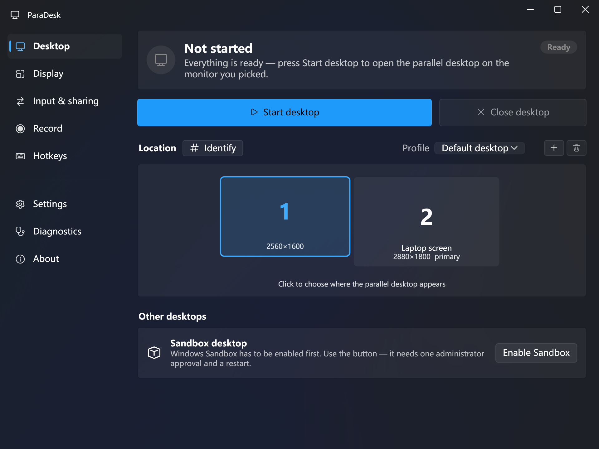
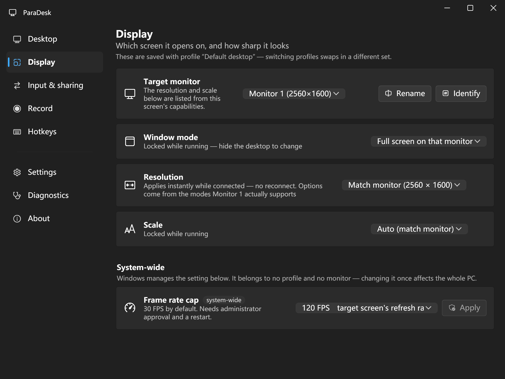
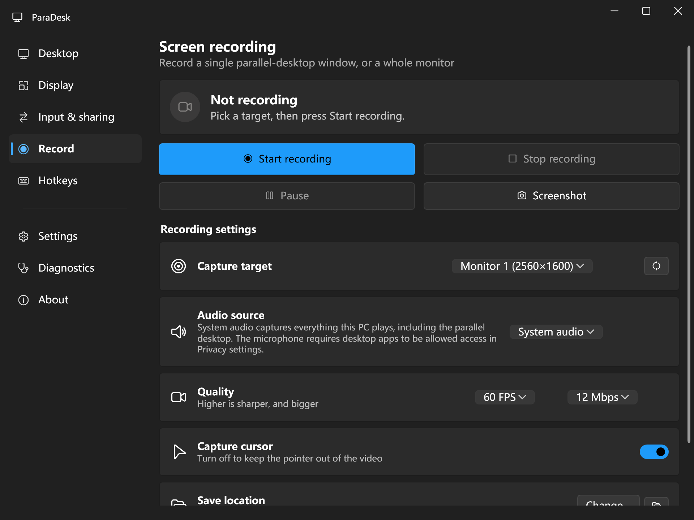
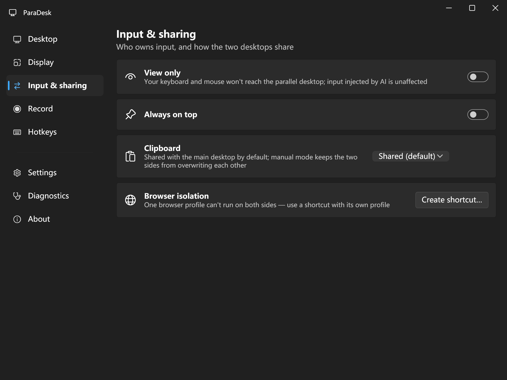

# ParaDesk

**A second Windows desktop on your spare monitor — with its own mouse and keyboard, sharing your account and all your files.**

[简体中文](#简体中文) · Windows 10 1903+ / Windows 11 · Pro edition or higher
· Source-available under [PolyForm Noncommercial](LICENSE) — free for personal, research and nonprofit use



---

## What problem this solves

AI coding agents (Claude Code, Codex, Copilot) increasingly drive the computer by looking at the screen and moving the mouse. While one is working, **your machine is unusable** — every click you make fights the agent for control.

The obvious fix is a virtual machine. But a VM is a *different computer*: different account, no shared files, and the agent's memory and work-in-progress do not carry over. You end up copying files back and forth all day.

ParaDesk takes the opposite trade. It opens a **second interactive Windows session for the same user account** on a monitor you pick:

- **Input is genuinely isolated** — Windows sessions each own their input queue. What the agent types over there never reaches your keyboard focus, and vice versa. This is enforced by the OS, not by a hook.
- **Everything else is shared** — same account, same disk, same installed apps, same browser logins. The agent's context and progress simply continue.

The trade-off is explicit and stated in the app: **there is no security isolation.** The second desktop can read every file you can. It is a productivity boundary, not a security boundary. If you need a security boundary, use a VM or Windows Sandbox.

---

## How it works

ParaDesk does not implement its own display or session stack. It drives a Windows feature that already exists:

```
WTSEnableChildSessions(true)        ← one-time, needs administrator
        │
        │  creates a second interactive session for the same account
        ▼
Remote Desktop client ActiveX (mstscax)
    Server   = "localhost"
    ConnectToChildSession = true    ← attaches to the local child session
        │
        │  loopback only — traffic never leaves the machine
        ▼
borderless window pinned to the monitor you chose
```

Consequences worth knowing:

| | |
|---|---|
| **Why input is isolated** | A Windows *session* owns its window station, desktop and input queue. Injected input in session B cannot reach session A. |
| **Why files are shared** | It is the same user account signing in a second time. No virtualisation layer exists. |
| **Why it needs Pro** | The child-session transport rides the Terminal Services stack. Home edition has no RDP *server* component at all — this is a missing component, not a disabled switch. |
| **Why recording needs WGC** | The RDP control composites through DirectX/DWM. GDI `BitBlt`/`PrintWindow` capture comes back black; only Windows.Graphics.Capture sees it. |
| **Why loopback quality is maxed** | No bandwidth is consumed locally, so hardware decoding and framebuffer sharing are enabled unconditionally. |

---

## Features

### Parallel desktop
- Full screen pinned to a monitor, resizable window, or floating picture-in-picture
- **Change resolution and scale live** — applies while connected, no reconnect
- Visual monitor map; click to assign. Screen identification overlay with big numbers
- **Rename your monitors** — "Left portrait", "AI workspace" — used everywhere in the app
- Profiles: different setups per monitor arrangement, auto-applied on hot-plug
- **View only** — locks *your* physical keyboard and mouse out of the parallel desktop so you cannot disturb the agent by accident. Input injected by automation is unaffected.
- Clipboard policy: shared / manual / off
- Browser isolation helper: one browser profile cannot run on both sides, so ParaDesk generates a shortcut with its own profile



### Screen recording
- Record **a single parallel-desktop window** or a whole monitor
- Audio: system loopback, microphone, or both mixed
- Pause and resume (paused time is excluded from the video), plus stills
- H.264 + AAC MP4, adjustable frame rate and bitrate



### Everything else
- Global hotkeys — show/hide the desktop, toggle view-only, start/stop recording
- Tray resident, run at startup, single-instance activation
- Frame-rate cap driven by the **actual refresh rates your monitors report**
- First-run guide, in-app log viewer, environment diagnostics with one-click repair
- Full English and Simplified Chinese, switchable at runtime



---

## Requirements

- Windows 10 1903+ or Windows 11
- **Pro, Enterprise or Education** — Home has no child-session support
- .NET Framework 4.8 (ships with Windows 10 1903+)
- One administrator approval on first use; everyday use needs no elevation

## Getting started

```powershell
git clone https://github.com/sinpoce/ParaDesk.git
cd ParaDesk
.\build.ps1 -Run
```

Press **Start desktop**. If the system has not been configured yet, ParaDesk asks once, takes a single administrator approval, and configures everything itself.

**A restart is required after that first configuration.** The Remote Desktop service cannot be restarted while a console session is active, so the child-session listener only comes up at boot.

### What the one-time configuration changes

- Enables Windows child sessions
- Enables the Remote Desktop listener (required by child sessions — loopback only, never over the network)
- Opens the matching firewall rules
- Allows delegating default credentials, so you are not asked for a password on every connect
- Sets the Remote Desktop service to start automatically

---

## Building

```powershell
.\build.ps1            # Debug
.\build.ps1 -Release   # Release
.\publish.ps1          # portable zip into dist\
```

Only the **.NET SDK** is required — `dotnet build` uses the SDK's MSBuild. Visual Studio and Build Tools are *not* needed: the net48 reference assemblies are a standalone component, and this project does not use `COMReference` interop generation.

## Self-tests

```powershell
.\selftest.ps1
```

| Command | Checks |
|---|---|
| `ParaDesk.exe --probe` | Environment probe, read-only, changes nothing |
| `ParaDesk.exe --i18ntest` | Localisation dictionary: duplicate keys, placeholder mismatches, empty translations |
| `ParaDesk.exe --dlgtest` | The child-session dialog guard closes what it should and leaves everything else alone |
| `ParaDesk.exe --rectest [sec]` | Records a clip and verifies duration and audio track |
| `ParaDesk.exe --contenttest` | Records three known solid colours, extracts frames, compares pixels — catches frame misordering and recycled textures |

`--contenttest` exists because recording bugs are invisible to the eye: duration, file size and playability can all be correct while the frames themselves are wrong. A machine has to measure it.

---

## Known limitations

These follow from how Windows works and are **not bugs**:

- **Only one parallel desktop at a time.** The child-session mechanism supports exactly one.
- **A restart is needed after first configuration.** Explained above.
- **Home edition is not supported.** No supported workaround exists. Patching `termsrv.dll` (RDP Wrapper and similar) breaks on every Windows update, is flagged by antivirus, and conflicts with the Home licence terms — it will not be shipped here.
- **No security isolation.** By design. Same account, same permissions, same files.
- **Windows shows a spurious error inside the child session.** The Windows shell package `MicrosoftWindows.Client.CBS` fails COM activation in a child session; the visible symptom is a *"Windows cannot access the specified device, path, or file"* dialog for `CrossDeviceResume.exe`. Every documented off-switch (`EnableCdp`, `EnableMmx`, `IsResumeAllowed`) was already off on the affected machine, and image-hijack blocking does not help either — the denial happens before `CreateProcess`, so the caller is almost certainly an AppContainer process with no right to launch a Win32 executable. ParaDesk cannot fix the root cause, so it runs a tiny guard inside the child session that dismisses **only that exact dialog**, matched by its full window title. It never dismisses anything else; `--dlgtest` verifies both halves of that promise.

---

## Project layout

```
src/ParaDesk.App/
  Core/          settings, monitors, display capabilities, localisation
  Rdp/           child-session connection, the borderless desktop window
  Recording/     WGC capture, WASAPI audio, MP4 encoding
  Ui/Wpf/        WPF Fluent interface
  Elevated/      the one-time elevated configuration host
  Diagnostics/   the self-test commands listed above
  Providers/     alternative desktop backends (Windows Sandbox)
```

~12,700 lines of C#. Comments explain *why*, not *what* — several of them record failed approaches so the next person does not retry them.

---

## Contributing

Issues and pull requests are welcome. Please run `.\selftest.ps1` before opening a PR; all five checks should pass.

By contributing you agree that your contribution is licensed under the same terms as the project.

## Licence

**[PolyForm Noncommercial 1.0.0](LICENSE)** — the source is public, and you may read, modify and redistribute it **for any noncommercial purpose**.

- ✅ Personal use, study, research, hobby projects
- ✅ Charities, schools, public research, government institutions
- ❌ Commercial use requires a separate licence from the author

To be precise about wording: this is **source-available**, not OSI-approved "open source". If you want to use ParaDesk commercially, open an issue and we can talk.

---
---

# 简体中文

**在闲置的显示器上开出第二个 Windows 桌面 —— 拥有独立的鼠标键盘，同时共用你的账户与全部文件。**

Windows 10 1903+ / Windows 11 · 需专业版及以上
· 采用 [PolyForm Noncommercial](LICENSE) 许可 —— 个人、研究、非营利用途免费

## 它解决什么问题

AI 编程助手（Claude Code、Codex、Copilot）越来越多地通过看屏幕、动鼠标来操作电脑。它干活的时候，**你的电脑就没法用了** —— 你每点一下都在跟它抢控制权。

最直觉的方案是虚拟机。但虚拟机是**另一台电脑**：账户不同、文件不通，AI 的记忆和工作进度全部断掉，你会整天在两边传文件。

ParaDesk 走的是相反的取舍。它用**同一个 Windows 账户**在你指定的显示器上开出第二个交互式会话：

- **输入是真隔离的** —— Windows 的会话各自拥有独立的输入队列。AI 在那边敲的键永远到不了你这边，反之亦然。这是操作系统保证的，不是靠钩子拦的。
- **其余全部共用** —— 同一账户、同一块盘、同一套软件、同一份浏览器登录状态。AI 的上下文和进度直接延续。

代价是明确的，程序里也如实写着：**它不做安全隔离。** 那边能读你所有文件。它是一条效率边界，不是安全边界。需要安全边界请用虚拟机或 Windows 沙盒。

## 原理

ParaDesk 没有自己实现显示或会话栈，它驱动的是 Windows 本来就有的能力：

```
WTSEnableChildSessions(true)        ← 一次性，需要管理员
        │
        │  为同一账户创建第二个交互式会话
        ▼
远程桌面客户端 ActiveX（mstscax）
    Server   = "localhost"
    ConnectToChildSession = true    ← 接管本机子会话
        │
        │  纯本机回环 —— 数据不出网卡
        ▼
无边框窗口，钉在你选的那块屏上
```

由此推出的几件事：

| | |
|---|---|
| **输入为什么是隔离的** | Windows 的**会话**拥有各自的 window station、桌面和输入队列。注入到会话 B 的输入到不了会话 A。 |
| **文件为什么是通的** | 就是同一个用户账户又登录了一次，中间没有任何虚拟化层。 |
| **为什么要专业版** | 子会话的传输层搭在终端服务上。家庭版**根本没有 RDP 服务端组件** —— 是组件不存在，不是开关被关掉。 |
| **录制为什么只能用 WGC** | RDP 控件走 DirectX/DWM 合成，GDI 的 `BitBlt`/`PrintWindow` 抓下来是全黑，只有 Windows.Graphics.Capture 拿得到。 |
| **画质开关为什么全开** | 本机回环不消耗带宽，所以硬件解码、帧缓冲共享无条件启用。 |

## 功能

**分身桌面** —— 全屏钉屏 / 可缩放窗口 / 悬浮小窗；连接中改分辨率与缩放即时生效，不断线；可视化屏幕布局图 + 屏幕识别；**给显示器起名**，全程序统一显示；多方案，热插拔自动套用；**仅查看**（锁住你自己的键鼠防误触，AI 注入的操作不受影响）；剪贴板策略；浏览器隔离助手。

**屏幕录制** —— 可单独录某个分身桌面窗口或整块显示器；系统声音 / 麦克风 / 两者混合；暂停恢复（暂停时长不计入视频）与截图；H.264 + AAC 的 MP4，帧率码率可调。

**其他** —— 全局热键；托盘常驻、开机自启、单实例激活；帧率上限按**显示器真实报告的刷新率**给选项；首次运行向导、应用内日志、环境诊断一键修复；中英双语，运行时可切换。

## 上手

```powershell
git clone https://github.com/sinpoce/ParaDesk.git
cd ParaDesk
.\build.ps1 -Run
```

点**启动桌面**。系统没配置过的话，ParaDesk 会问一次、要一次管理员授权，然后自己全部配好。

**那次配置之后需要重启一次电脑**：有活动控制台会话时远程桌面服务停不掉，子会话监听器只能随开机启动。

配置会改这些：启用子会话；启用远程桌面监听器（子会话的必要前置，走本机回环、不经过网络）；开放对应防火墙规则；允许委派默认凭据（免除每次输密码）；把远程桌面服务设为自动启动。

## 构建与自检

```powershell
.\build.ps1            # Debug
.\build.ps1 -Release   # Release
.\publish.ps1          # 打包绿色版 zip 到 dist\
.\selftest.ps1         # 五项自检
```

只需 **.NET SDK**，不需要 Visual Studio 或 Build Tools。

其中 `--contenttest` 存在的理由：录制类缺陷肉眼极难发现 —— 时长、文件大小、能否播放全都正常，画面内容却可能是错的。必须让机器去量。

## 已知限制

这些都是系统机制决定的，**不是 bug**：

- **同时只能有一个分身桌面**，子会话机制就只支持一个
- **首次配置后需要重启一次**，原因见上
- **不支持家庭版**，且没有正当的绕过办法。改 `termsrv.dll` 那类补丁每次系统更新就失效、杀软普遍报毒、还与家庭版许可条款冲突，本项目不会内置
- **不做安全隔离**，这是设计取舍
- **子会话里 Windows 会弹一个它自己修不好的错误框**：外壳包 `MicrosoftWindows.Client.CBS` 在子会话里 COM 激活失败，表现为 `CrossDeviceResume.exe` 的"Windows 无法访问指定设备、路径或文件"。所有官方开关（`EnableCdp`、`EnableMmx`、`IsResumeAllowed`）在出问题的机器上本来就是关的，映像劫持也拦不住 —— 拒绝发生在 `CreateProcess` 之前，调用方多半是个无权拉起 Win32 程序的 AppContainer 进程。根因修不了，所以 ParaDesk 在子会话内跑一个极小的守护，**只关标题完全等于那个路径的对话框**，绝不碰别的；`--dlgtest` 对这两半都做了验证。

## 许可证

**[PolyForm Noncommercial 1.0.0](LICENSE)** —— 源码公开，**任何非商业用途**下都可自由阅读、修改、再分发。

- ✅ 个人使用、学习、研究、业余项目
- ✅ 慈善机构、学校、公立研究机构、政府部门
- ❌ 商业用途需另行向作者获得授权

措辞上说清楚：这是**源码可见（source-available）**，不是 OSI 认证的「开源」。需要商业授权请开 issue 联系。
